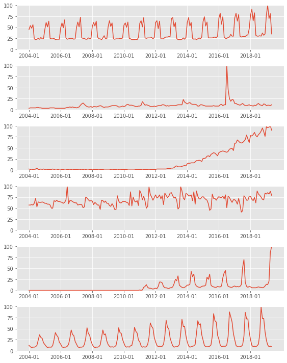
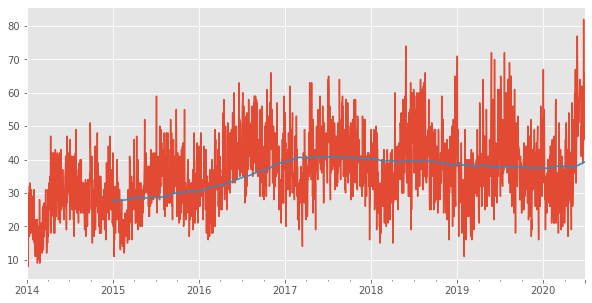
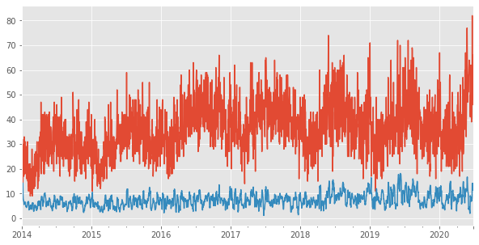
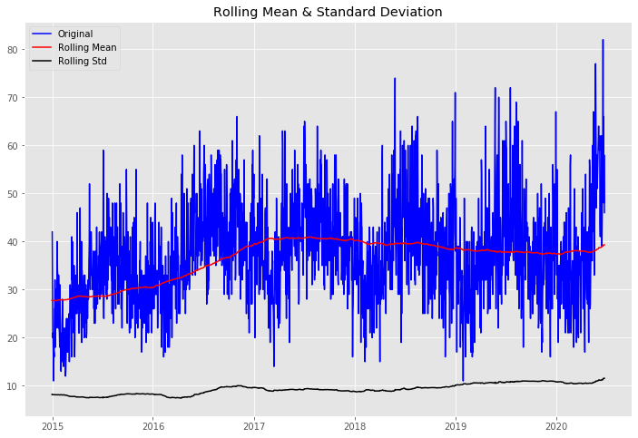
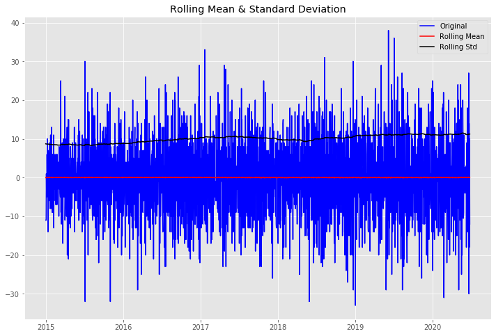

# Time Series

To begin, let's look at some time series data plots.


```python
import pandas as pd
import numpy as np
pd.set_option('display.max_rows', 1000)
```


```python
# Define a function that will help us load and
# clean up a dataset.

def load_trend(trend_name='football', country_code='us'):
    df = pd.read_csv('data/google-trends_'
                     + trend_name + '_'
                     + country_code
                     + '.csv').iloc[1:, :]
    df.columns = ['counts']
    df['counts'] = df['counts'].str.replace('<1', '0').astype(int)
    return df
```


```python
df = load_trend(**{'trend_name': 'data-science', 'country_code': 'us'})

```


```python
trends = [
    {'trend_name': 'data-science', 'country_code': 'us'},
    {'trend_name': 'football', 'country_code': 'us'},
    {'trend_name': 'football', 'country_code': 'uk'},
    {'trend_name': 'game-of-thrones', 'country_code': 'us'},
    {'trend_name': 'pokemon', 'country_code': 'us'},
    {'trend_name': 'taxes', 'country_code': 'us'},   
]
```


```python
np.random.shuffle(trends)

```


```python
trend_dfs = [load_trend(**trend) for trend in trends]

```

The ** syntax is used to pass keywords and values in dictionary form to a function. For more on * and ** (*args and **kwargs), see this page.


```python
import matplotlib.pyplot as plt
# Let's see if we can guess which is which just by looking
# at their graphs.


import matplotlib; matplotlib.style.use('ggplot')

fig, axs = plt.subplots(len(trend_dfs), 1, figsize=(8, 10))
plt.tight_layout()
for i, trend_df in enumerate(trend_dfs):
    ax = axs[i]
    #ax.set_title(str(trends[i]))
    ax.plot(np.array(trend_df.index), trend_df['counts'])
    ticks = ax.get_xticks()
    ax.set_ylim((0, 100))
    ax.set_xticks([tick for tick in ticks if tick%24 == 0])
```





# Time Series vs. Linear

For linear regression, we attempted to explain the variance of a continuous target variable via a set of **independent predictor features**. We assumed that there was no **autocorrelation** amongst our records.  In other words, we did not use the target variable of one row to predict that of another.

In time series models, we make the opposite assumption.  We assume that a given value can best be predicted by its **past values**.

We replace our features with past values of our target. 

The models we will cover in lecture include endogenous variables.
<em>Endogenous</em> means caused by factors within the system. 

<em>Exogenous</em>, caused by factors outside the system. 

Many statsmodels tools use <tt>endog</tt> to represent the incoming time series data in place of the constant <tt>y</tt>.<br>

For more information and a nice **mneumonic**, visit http://www.statsmodels.org/stable/endog_exog.html

# Datetime objects

Datetime objects make our time series modeling lives easier.  They will allow us to perform essential data prep tasks with a few lines of code.  

We need our timeseries **index** to be datetime objects, since our models will rely on being able to identify the previous chronological value.

There is a datetime [library](https://docs.python.org/2/library/datetime.html), and inside pandas there is a datetime module as well as a to_datetime() function.


Let's import some data on **gun violence in Chicago**.

[source](https://data.cityofchicago.org/Public-Safety/Gun-Crimes-Heat-Map/iinq-m3rg)


```python
ts = pd.read_csv('data/Gun_Crimes_Heat_Map.csv')
```


```python
ts.head()
```


<div>
<style scoped>
    .dataframe tbody tr th:only-of-type {
        vertical-align: middle;
    }

    .dataframe tbody tr th {
        vertical-align: top;
    }

    .dataframe thead th {
        text-align: right;
    }
</style>
<table border="1" class="dataframe">
  <thead>
    <tr style="text-align: right;">
      <th></th>
      <th>ID</th>
      <th>Case Number</th>
      <th>Date</th>
      <th>Block</th>
      <th>IUCR</th>
      <th>Primary Type</th>
      <th>Description</th>
      <th>Location Description</th>
      <th>Arrest</th>
      <th>Domestic</th>
      <th>...</th>
      <th>Ward</th>
      <th>Community Area</th>
      <th>FBI Code</th>
      <th>X Coordinate</th>
      <th>Y Coordinate</th>
      <th>Year</th>
      <th>Updated On</th>
      <th>Latitude</th>
      <th>Longitude</th>
      <th>Location</th>
    </tr>
  </thead>
  <tbody>
    <tr>
      <th>0</th>
      <td>11236423</td>
      <td>JB159764</td>
      <td>02/10/2018 08:00:00 AM</td>
      <td>130XX S LANGLEY AVE</td>
      <td>051A</td>
      <td>ASSAULT</td>
      <td>AGGRAVATED: HANDGUN</td>
      <td>STREET</td>
      <td>False</td>
      <td>False</td>
      <td>...</td>
      <td>9.0</td>
      <td>54</td>
      <td>04A</td>
      <td>NaN</td>
      <td>NaN</td>
      <td>2018</td>
      <td>02/22/2018 03:58:56 PM</td>
      <td>NaN</td>
      <td>NaN</td>
      <td>NaN</td>
    </tr>
    <tr>
      <th>1</th>
      <td>10568438</td>
      <td>HZ316534</td>
      <td>06/20/2016 10:18:00 PM</td>
      <td>024XX E 71ST ST</td>
      <td>031A</td>
      <td>ROBBERY</td>
      <td>ARMED: HANDGUN</td>
      <td>SIDEWALK</td>
      <td>False</td>
      <td>False</td>
      <td>...</td>
      <td>7.0</td>
      <td>43</td>
      <td>03</td>
      <td>NaN</td>
      <td>NaN</td>
      <td>2016</td>
      <td>06/27/2016 03:51:44 PM</td>
      <td>NaN</td>
      <td>NaN</td>
      <td>NaN</td>
    </tr>
    <tr>
      <th>2</th>
      <td>10394395</td>
      <td>HY298019</td>
      <td>06/11/2015 08:28:00 PM</td>
      <td>058XX S UNION AVE</td>
      <td>143A</td>
      <td>WEAPONS VIOLATION</td>
      <td>UNLAWFUL POSS OF HANDGUN</td>
      <td>RESIDENCE</td>
      <td>False</td>
      <td>False</td>
      <td>...</td>
      <td>3.0</td>
      <td>68</td>
      <td>15</td>
      <td>NaN</td>
      <td>NaN</td>
      <td>2015</td>
      <td>07/22/2016 03:49:06 PM</td>
      <td>NaN</td>
      <td>NaN</td>
      <td>NaN</td>
    </tr>
    <tr>
      <th>3</th>
      <td>10370206</td>
      <td>HY400660</td>
      <td>08/28/2015 11:06:00 AM</td>
      <td>039XX W GRENSHAW ST</td>
      <td>143A</td>
      <td>WEAPONS VIOLATION</td>
      <td>UNLAWFUL POSS OF HANDGUN</td>
      <td>APARTMENT</td>
      <td>False</td>
      <td>False</td>
      <td>...</td>
      <td>24.0</td>
      <td>29</td>
      <td>15</td>
      <td>NaN</td>
      <td>NaN</td>
      <td>2015</td>
      <td>08/04/2016 03:52:47 PM</td>
      <td>NaN</td>
      <td>NaN</td>
      <td>NaN</td>
    </tr>
    <tr>
      <th>4</th>
      <td>10300408</td>
      <td>HY397968</td>
      <td>08/26/2015 09:30:00 AM</td>
      <td>041XX W MAYPOLE AVE</td>
      <td>143A</td>
      <td>WEAPONS VIOLATION</td>
      <td>UNLAWFUL POSS OF HANDGUN</td>
      <td>SIDEWALK</td>
      <td>False</td>
      <td>False</td>
      <td>...</td>
      <td>28.0</td>
      <td>26</td>
      <td>15</td>
      <td>NaN</td>
      <td>NaN</td>
      <td>2015</td>
      <td>06/17/2016 03:52:24 PM</td>
      <td>NaN</td>
      <td>NaN</td>
      <td>NaN</td>
    </tr>
  </tbody>
</table>
<p>5 rows × 22 columns</p>
</div>


There are a few ways to **reindex** our series to datetime. 

We can use the pd.to_datetime() method


```python
ts.set_index(pd.to_datetime(ts['Date']), drop=True, inplace=True)
```

Or, we can parse the dates directly on import


```python
ts =  pd.read_csv('data/Gun_Crimes_Heat_Map.csv', index_col='Date', parse_dates=True)
```

We've covered some of the fun abilities of datetime objects, including being able to extract componenets of the date like so:


```python
ts.index[0].month
```


    2


```python
ts.index[0].year
```


    2018


Now we will explore new abilities, such as **resampling**.

To create our timeseries, we will count the number of gun offenses reported per day.


```python
ts.resample('D')
```


    <pandas.core.resample.DatetimeIndexResampler object at 0x1a3e034748>


Take a moment to familiarize yourself with the differnece resampling aliases

<table style="display: inline-block">
    <caption style="text-align: center"><strong>TIME SERIES OFFSET ALIASES</strong></caption>
<tr><th>ALIAS</th><th>DESCRIPTION</th></tr>
<tr><td>B</td><td>business day frequency</td></tr>
<tr><td>C</td><td>custom business day frequency (experimental)</td></tr>
<tr><td>D</td><td>calendar day frequency</td></tr>
<tr><td>W</td><td>weekly frequency</td></tr>
<tr><td>M</td><td>month end frequency</td></tr>
<tr><td>SM</td><td>semi-month end frequency (15th and end of month)</td></tr>
<tr><td>BM</td><td>business month end frequency</td></tr>
<tr><td>CBM</td><td>custom business month end frequency</td></tr>
<tr><td>MS</td><td>month start frequency</td></tr>
<tr><td>SMS</td><td>semi-month start frequency (1st and 15th)</td></tr>
<tr><td>BMS</td><td>business month start frequency</td></tr>
<tr><td>CBMS</td><td>custom business month start frequency</td></tr>
<tr><td>Q</td><td>quarter end frequency</td></tr>
<tr><td></td><td><font color=white>intentionally left blank</font></td></tr></table>

<table style="display: inline-block; margin-left: 40px">
<caption style="text-align: center"></caption>
<tr><th>ALIAS</th><th>DESCRIPTION</th></tr>
<tr><td>BQ</td><td>business quarter endfrequency</td></tr>
<tr><td>QS</td><td>quarter start frequency</td></tr>
<tr><td>BQS</td><td>business quarter start frequency</td></tr>
<tr><td>A</td><td>year end frequency</td></tr>
<tr><td>BA</td><td>business year end frequency</td></tr>
<tr><td>AS</td><td>year start frequency</td></tr>
<tr><td>BAS</td><td>business year start frequency</td></tr>
<tr><td>BH</td><td>business hour frequency</td></tr>
<tr><td>H</td><td>hourly frequency</td></tr>
<tr><td>T, min</td><td>minutely frequency</td></tr>
<tr><td>S</td><td>secondly frequency</td></tr>
<tr><td>L, ms</td><td>milliseconds</td></tr>
<tr><td>U, us</td><td>microseconds</td></tr>
<tr><td>N</td><td>nanoseconds</td></tr></table>

When resampling, we have to provide a rule to resample by, and an aggregate function.

**To upsample** is to increase the frequency of the data of interest.  
**To downsample** is to decrease the frequency of the data of interest.

For our purposes, we will downsample, and  count the number of occurences per day.


```python
ts.resample('D').count()
```


<div>
<style scoped>
    .dataframe tbody tr th:only-of-type {
        vertical-align: middle;
    }

    .dataframe tbody tr th {
        vertical-align: top;
    }

    .dataframe thead th {
        text-align: right;
    }
</style>
<table border="1" class="dataframe">
  <thead>
    <tr style="text-align: right;">
      <th></th>
      <th>ID</th>
      <th>Case Number</th>
      <th>Block</th>
      <th>IUCR</th>
      <th>Primary Type</th>
      <th>Description</th>
      <th>Location Description</th>
      <th>Arrest</th>
      <th>Domestic</th>
      <th>Beat</th>
      <th>...</th>
      <th>Ward</th>
      <th>Community Area</th>
      <th>FBI Code</th>
      <th>X Coordinate</th>
      <th>Y Coordinate</th>
      <th>Year</th>
      <th>Updated On</th>
      <th>Latitude</th>
      <th>Longitude</th>
      <th>Location</th>
    </tr>
    <tr>
      <th>Date</th>
      <th></th>
      <th></th>
      <th></th>
      <th></th>
      <th></th>
      <th></th>
      <th></th>
      <th></th>
      <th></th>
      <th></th>
      <th></th>
      <th></th>
      <th></th>
      <th></th>
      <th></th>
      <th></th>
      <th></th>
      <th></th>
      <th></th>
      <th></th>
      <th></th>
    </tr>
  </thead>
  <tbody>
    <tr>
      <th>2014-01-01</th>
      <td>50</td>
      <td>50</td>
      <td>50</td>
      <td>50</td>
      <td>50</td>
      <td>50</td>
      <td>50</td>
      <td>50</td>
      <td>50</td>
      <td>50</td>
      <td>...</td>
      <td>50</td>
      <td>50</td>
      <td>50</td>
      <td>50</td>
      <td>50</td>
      <td>50</td>
      <td>50</td>
      <td>50</td>
      <td>50</td>
      <td>50</td>
    </tr>
    <tr>
      <th>2014-01-02</th>
      <td>33</td>
      <td>33</td>
      <td>33</td>
      <td>33</td>
      <td>33</td>
      <td>33</td>
      <td>33</td>
      <td>33</td>
      <td>33</td>
      <td>33</td>
      <td>...</td>
      <td>33</td>
      <td>33</td>
      <td>33</td>
      <td>33</td>
      <td>33</td>
      <td>33</td>
      <td>33</td>
      <td>33</td>
      <td>33</td>
      <td>33</td>
    </tr>
    <tr>
      <th>2014-01-03</th>
      <td>24</td>
      <td>24</td>
      <td>24</td>
      <td>24</td>
      <td>24</td>
      <td>24</td>
      <td>24</td>
      <td>24</td>
      <td>24</td>
      <td>24</td>
      <td>...</td>
      <td>24</td>
      <td>24</td>
      <td>24</td>
      <td>24</td>
      <td>24</td>
      <td>24</td>
      <td>24</td>
      <td>24</td>
      <td>24</td>
      <td>24</td>
    </tr>
    <tr>
      <th>2014-01-04</th>
      <td>32</td>
      <td>32</td>
      <td>32</td>
      <td>32</td>
      <td>32</td>
      <td>32</td>
      <td>32</td>
      <td>32</td>
      <td>32</td>
      <td>32</td>
      <td>...</td>
      <td>32</td>
      <td>32</td>
      <td>32</td>
      <td>32</td>
      <td>32</td>
      <td>32</td>
      <td>32</td>
      <td>32</td>
      <td>32</td>
      <td>32</td>
    </tr>
    <tr>
      <th>2014-01-05</th>
      <td>17</td>
      <td>17</td>
      <td>17</td>
      <td>17</td>
      <td>17</td>
      <td>17</td>
      <td>17</td>
      <td>17</td>
      <td>17</td>
      <td>17</td>
      <td>...</td>
      <td>17</td>
      <td>17</td>
      <td>17</td>
      <td>17</td>
      <td>17</td>
      <td>17</td>
      <td>17</td>
      <td>17</td>
      <td>17</td>
      <td>17</td>
    </tr>
    <tr>
      <th>...</th>
      <td>...</td>
      <td>...</td>
      <td>...</td>
      <td>...</td>
      <td>...</td>
      <td>...</td>
      <td>...</td>
      <td>...</td>
      <td>...</td>
      <td>...</td>
      <td>...</td>
      <td>...</td>
      <td>...</td>
      <td>...</td>
      <td>...</td>
      <td>...</td>
      <td>...</td>
      <td>...</td>
      <td>...</td>
      <td>...</td>
      <td>...</td>
    </tr>
    <tr>
      <th>2020-06-21</th>
      <td>52</td>
      <td>52</td>
      <td>52</td>
      <td>52</td>
      <td>52</td>
      <td>52</td>
      <td>52</td>
      <td>52</td>
      <td>52</td>
      <td>52</td>
      <td>...</td>
      <td>52</td>
      <td>52</td>
      <td>52</td>
      <td>52</td>
      <td>52</td>
      <td>52</td>
      <td>52</td>
      <td>52</td>
      <td>52</td>
      <td>52</td>
    </tr>
    <tr>
      <th>2020-06-22</th>
      <td>66</td>
      <td>66</td>
      <td>66</td>
      <td>66</td>
      <td>66</td>
      <td>66</td>
      <td>66</td>
      <td>66</td>
      <td>66</td>
      <td>66</td>
      <td>...</td>
      <td>66</td>
      <td>66</td>
      <td>66</td>
      <td>66</td>
      <td>66</td>
      <td>66</td>
      <td>66</td>
      <td>66</td>
      <td>66</td>
      <td>66</td>
    </tr>
    <tr>
      <th>2020-06-23</th>
      <td>48</td>
      <td>48</td>
      <td>48</td>
      <td>48</td>
      <td>48</td>
      <td>48</td>
      <td>48</td>
      <td>48</td>
      <td>48</td>
      <td>48</td>
      <td>...</td>
      <td>48</td>
      <td>48</td>
      <td>48</td>
      <td>48</td>
      <td>48</td>
      <td>48</td>
      <td>48</td>
      <td>48</td>
      <td>48</td>
      <td>48</td>
    </tr>
    <tr>
      <th>2020-06-24</th>
      <td>58</td>
      <td>58</td>
      <td>58</td>
      <td>58</td>
      <td>58</td>
      <td>58</td>
      <td>58</td>
      <td>58</td>
      <td>58</td>
      <td>58</td>
      <td>...</td>
      <td>58</td>
      <td>58</td>
      <td>58</td>
      <td>58</td>
      <td>58</td>
      <td>58</td>
      <td>58</td>
      <td>58</td>
      <td>58</td>
      <td>58</td>
    </tr>
    <tr>
      <th>2020-06-25</th>
      <td>46</td>
      <td>46</td>
      <td>46</td>
      <td>46</td>
      <td>46</td>
      <td>46</td>
      <td>46</td>
      <td>46</td>
      <td>46</td>
      <td>46</td>
      <td>...</td>
      <td>46</td>
      <td>46</td>
      <td>46</td>
      <td>46</td>
      <td>46</td>
      <td>46</td>
      <td>46</td>
      <td>46</td>
      <td>46</td>
      <td>46</td>
    </tr>
  </tbody>
</table>
<p>2368 rows × 21 columns</p>
</div>


Our time series will consist of a series of counts of gun reports per day.


```python
# ID is unimportant. We could have chosen any column, since the counts are the same.
ts = ts.resample('D').count()['ID']
```


```python
ts
```


    Date
    2014-01-01    50
    2014-01-02    33
    2014-01-03    24
    2014-01-04    32
    2014-01-05    17
                  ..
    2020-06-21    52
    2020-06-22    66
    2020-06-23    48
    2020-06-24    58
    2020-06-25    46
    Freq: D, Name: ID, Length: 2368, dtype: int64


Let's visualize our timeseries with a plot.


```python
import matplotlib.pyplot as plt

fig, ax = plt.subplots(figsize=(10,5))
ax.plot(ts.index, ts.values)
ax.set_title('Gun Crimes per day in Chicago')
ax.set_ylabel('Reported Gun Crimes')
```


    Text(0, 0.5, 'Reported Gun Crimes')


There seems to be some abnormal activity happening towards the end of our series.

**[sun-times](https://chicago.suntimes.com/crime/2020/6/8/21281998/chicago-deadliest-day-violence-murder-history-police-crime)**


```python
ts.sort_values(ascending=False)[:10]
```


    Date
    2020-05-31    130
    2020-06-02    109
    2020-06-01     97
    2020-06-03     95
    2020-05-25     93
    2020-06-20     82
    2020-05-24     77
    2018-05-28     74
    2019-05-26     72
    2019-07-20     72
    Name: ID, dtype: int64


Let's treat the span of days from 5-31 to 6-03 as outliers. 

There are several ways to do this, but let's first remove the outliers, and populate an an empty array with the original date range.  That will introduce us to the pd.date_range method.


```python
daily_count = ts[ts < 90]
ts_dr = pd.date_range(daily_count.index[0], daily_count.index[-1])
ts_daily = np.empty(shape=len(ts_dr))
ts_daily = pd.Series(ts_daily)
ts_daily = ts_daily.reindex(ts_dr)
ts = ts_daily.fillna(daily_count)
```


```python
ts
```


    2014-01-01    50.0
    2014-01-02    33.0
    2014-01-03    24.0
    2014-01-04    32.0
    2014-01-05    17.0
                  ... 
    2020-06-21    52.0
    2020-06-22    66.0
    2020-06-23    48.0
    2020-06-24    58.0
    2020-06-25    46.0
    Freq: D, Length: 2368, dtype: float64


Now let's sp


```python
fig, ax = plt.subplots(figsize=(10,5))
ts.plot(ax=ax)
ax.set_title('Gun Crimes in Chicago with Deadliest Days Removed');
```


Let's zoom in on that week again


```python
fig, ax = plt.subplots()
ax.plot(ts[(ts.index > '2020-05-20') 
                 & (ts.index < '2020-06-07')]
       )
ax.tick_params(rotation=45)
ax.set_title('We have some gaps now')
```


    Text(0.5, 1.0, 'We have some gaps now')


The datetime object allows us several options of how to fill those gaps:


```python
fig, (ax1,ax2) = plt.subplots(1,2, figsize = (10,5))
ax1.plot(ts.ffill()[(ts.index > '2020-05-20') 
                 & (ts.index < '2020-06-07')]
       )
ax1.tick_params(rotation=45)
ax1.set_title('Forward Fill')

ax2.plot(ts[(ts.index > '2020-05-20') 
                 & (ts.index < '2020-06-07')]
       )
ax2.tick_params(rotation=45)
ax2.set_title('Original')

```


    Text(0.5, 1.0, 'Original')


```python
fig, (ax1,ax2) = plt.subplots(1,2, figsize = (10,5))
ax1.plot(ts.bfill()[(ts.index > '2020-05-20') 
                 & (ts.index < '2020-06-07')]
       )
ax1.tick_params(rotation=45)
ax1.set_title('Back Fill')

ax2.plot(ts[(ts.index > '2020-05-20') 
                 & (ts.index < '2020-06-07')]
       )
ax2.tick_params(rotation=45)
ax2.set_title('Original')
```


    Text(0.5, 1.0, 'Original')


```python
fig, (ax1,ax2) = plt.subplots(1,2, figsize = (10,5))
ax1.plot(ts.interpolate()[(ts.index > '2020-05-20') 
                 & (ts.index < '2020-06-07')]
       )
ax1.tick_params(rotation=45)
ax1.set_title('Interpolation')

ax2.plot(ts[(ts.index > '2020-05-20') 
                 & (ts.index < '2020-06-07')]
       )
ax2.tick_params(rotation=45)
ax2.set_title('Original')
```


    Text(0.5, 1.0, 'Original')


Let's proceed with the interpolated data


```python
ts = ts.interpolate()
ts.isna().sum()
```


    0


Let's begin considering some models for our data.

These are not useful for prediction just yet, but they will lead us towards our prediction models.

Now that we've cleaned up a few data points, let's downsample to the week level.  


```python
ts_weekly = ts.resample('W').mean()
```


```python
ts_weekly.plot()
```


    <matplotlib.axes._subplots.AxesSubplot at 0x1a31de3eb8>


# Visual Diagnostics with SMA and EWMA

# Simple Moving Average

A simple moving average consists of an average across a specified window of time. 

The datetime index allows us to calculate simple moving averages via the rolling function.

Let's calculate a week long rolling average


```python
ts_weekly.rolling(7).mean()[:10]
```


    2014-01-05          NaN
    2014-01-12          NaN
    2014-01-19          NaN
    2014-01-26          NaN
    2014-02-02          NaN
    2014-02-09          NaN
    2014-02-16    22.130612
    2014-02-23    19.795918
    2014-03-02    19.469388
    2014-03-09    18.632653
    Freq: W-SUN, dtype: float64


```python
# Drop the NaN's that occur because their aren't enough values for the window
sma_week = ts_weekly.rolling(4).mean()

fig, ax = plt.subplots(figsize=(10,5))

ts_weekly.plot(ax=ax)
sma_week.plot(ax=ax)
```


    <matplotlib.axes._subplots.AxesSubplot at 0x1291999b0>


```python
# Let's zoom in

fig, ax = plt.subplots(figsize=(10,5))

ts_weekly[-100:].plot(ax=ax, c='r')
sma_week[-100:].plot(ax=ax, c='b')

```


    <matplotlib.axes._subplots.AxesSubplot at 0x12a1e3898>


The simple moving avereage tracks fairly well, but does not reach to the peaks and valleys of the original distribution.

# EWMA
## Exponentially Weighted Moving Average 

We just showed how to calculate the SMA based on some window. However, basic SMA has some weaknesses:

* Smaller windows will lead to more noise, rather than signal
* It will always lag by the size of the window
* It will never reach to full peak or valley of the data due to the averaging.
* Extreme historical values can skew your SMA significantly

To help fix some of these issues, we can use an <a href='https://en.wikipedia.org/wiki/Exponential_smoothing'>EWMA (Exponentially weighted moving average)</a>.

EWMA gives greater weight to values closer to the point of interest.

Moving averages capture some information about our timeseries.  They show us how windows of past data points inform the data point in question.  They won't, however, allow us to predict in to the future beyond a straight line from the last point.  They also won't capture important trends in our dataset.


Let's plot our rolling statistics with some different windows


```python
fig, ax = plt.subplots(figsize=(10,5))

ts_weekly[-100:].plot(ax=ax, c='r', label='Original')
ts_weekly.rolling(4).mean().dropna()[-100:].plot(ax=ax, c='g', label='SMA')
ts_weekly.ewm(span=4).mean().dropna()[-100:].plot(ax=ax, c='b', label='EWMA')
```


    <matplotlib.axes._subplots.AxesSubplot at 0x1a3cdd0710>





```python
fig, ax = plt.subplots(figsize=(10,5))

ts_weekly.plot(ax=ax, c='r', label='Original')
ts_weekly.rolling(16).mean().dropna().plot(ax=ax, c='g', label='SMA')
ts_weekly.ewm(span=16).mean().dropna().plot(ax=ax, c='b', label='EWMA')
```


    <matplotlib.axes._subplots.AxesSubplot at 0x1a3ee60b70>





```python
fig, ax = plt.subplots(figsize=(10,5))

ts_weekly.plot(ax=ax, c='r', label='Original')
ts_weekly.rolling(52).mean().dropna().plot(ax=ax, c='g', label='SMA')
ts_weekly.ewm(span=52).mean().dropna().plot(ax=ax, c='b', label='EWMA')
```


    <matplotlib.axes._subplots.AxesSubplot at 0x1a3f939240>


```python
fig, ax = plt.subplots(figsize=(10,5))

ts_weekly.plot(ax=ax, c='r', label='Original')
ts_weekly.rolling(4).std().dropna().plot(ax=ax, c='g', label='SMA')
ts_weekly.ewm(span=4).std().dropna().plot(ax=ax, c='b', label='EWMA')
```


    <matplotlib.axes._subplots.AxesSubplot at 0x1a3efe97b8>


```python

fig, ax = plt.subplots(figsize=(10,5))

ts_weekly.rolling(52).var().dropna().plot(ax=ax, c='g', label='SMA')
ts_weekly.ewm(span=52).var().dropna().plot(ax=ax, c='b', label='EWMA')
```


    <matplotlib.axes._subplots.AxesSubplot at 0x1a3fda4fd0>


If we zoom in on our standard deviation, we can the variance of our data has quite a fluctuation at different moments in time.


### Components of Time Series Data
A time series in general is supposed to be affected by four main components, which can be separated from the observed data. These components are: *Trend, Cyclical, Seasonal and Irregular* components.

- **Trend** : The long term movement of a time series. For example, series relating to population growth, number of houses in a city etc. show upward trend.
- **Seasonality** : Fluctuation in the data set that follow a regular pattern due to outside influences. For example sales of ice-cream increase in summer, or daily web traffic.
- **Cyclical** : When data exhibit rises and falls that are not of fixed period.  Think of business cycles which usually last several years, but where the length of the current cycle is unknown beforehand.
- **Irregular**: Are caused by unpredictable influences, which are not regular and also do not repeat in a particular pattern. These variations are caused by incidences such as war, strike, earthquake, flood, revolution, etc. There is no defined statistical technique for measuring random fluctuations in a time series.


*Note: Many people confuse cyclic behaviour with seasonal behaviour, but they are really quite different. If the fluctuations are not of fixed period then they are cyclic; if the period is unchanging and associated with some aspect of the calendar, then the pattern is seasonal.*

The statsmodels seasonal decompose can also help show us the trends in our data.


```python
from statsmodels.tsa.seasonal import seasonal_decompose
decomposition = seasonal_decompose(ts_weekly)
fig = plt.figure()
fig = decomposition.plot()
fig.set_size_inches(15, 8)
```


    <Figure size 432x288 with 0 Axes>


### Statistical stationarity: 

When building our models, we will want to account for these trends somehow.  Time series whose mean and variance have trends across time will be difficult to predict out into the future. 

A **stationary time series** is one whose statistical properties such as mean, variance, autocorrelation, etc. are all constant over time. Most statistical forecasting methods are based on the assumption that the time series can be rendered approximately stationary (i.e., "stationarized") through the use of mathematical transformations. A stationarized series is relatively easy to predict: you simply predict that its statistical properties will be the same in the future as they have been in the past!  


<h3 style="text-align: center;">Constant Mean</p>


<h3 style="text-align: center;">Constant Variance</p>


<h3 style="text-align: center;">Constant Covariance</p>


While we can get a sense of how stationary our data is with visuals, the Dickey Fuller test gives us a quantitatitive measure.

Here the null hypothesis is that the TS is non-stationary. If the ‘Test Statistic’ is less than the ‘Critical Value’, we can reject the null hypothesis and say that the series is stationary.


```python
from statsmodels.tsa.stattools import adfuller

#create a function that will help us to quickly 
def test_stationarity(timeseries, window):
    
    #Determing rolling statistics
    rolmean = timeseries.rolling(window=window).mean()
    rolstd = timeseries.rolling(window=window).std()

    #Plot rolling statistics:
    fig = plt.figure(figsize=(12, 8))
    orig = plt.plot(timeseries.iloc[window:], color='blue',label='Original')
    mean = plt.plot(rolmean, color='red', label='Rolling Mean')
    std = plt.plot(rolstd, color='black', label = 'Rolling Std')
    plt.legend(loc='best')
    plt.title('Rolling Mean & Standard Deviation')
    plt.show()
    
    #Perform Dickey-Fuller test:
    print ('Results of Dickey-Fuller Test:')
    dftest = adfuller(timeseries, autolag='AIC')
    dfoutput = pd.Series(dftest[0:4], index=['Test Statistic','p-value','#Lags Used','Number of Observations Used'])
    for key,value in dftest[4].items():
        dfoutput['Critical Value (%s)'%key] = value
    print (dfoutput)

```


```python
test_stationarity(ts_weekly, 52)
```





    Results of Dickey-Fuller Test:
    Test Statistic                  -2.562238
    p-value                          0.101056
    #Lags Used                       4.000000
    Number of Observations Used    334.000000
    Critical Value (1%)             -3.450081
    Critical Value (5%)             -2.870233
    Critical Value (10%)            -2.571401
    dtype: float64


As we concluded visually, our original timeseries does not pass the test of stationarity.

### How to stationarize time series data

A series of steps can be taken to stationarize your data - also known -  as removing trends (linear trends, seasonaility/periodicity, etc - more details on transformations <a href='http://people.duke.edu/~rnau/whatuse.htm'>here</a>).


One way to remove trends is to difference our data.  
Differencing is performed by subtracting the previous observation (lag=1) from the current observation.

Sometimes, we have to difference the differenced data (known as a second difference) to achieve stationary data. <b>The number of times we have to difference our data is the order of differencing</b> - we will use this information when building our model.

Let's difference our data and see if it improves Dickey-Fuller Test


```python
ts_weekly.diff().dropna()
```


    2014-01-12   -12.200000
    2014-01-19     5.571429
    2014-01-26     0.000000
    2014-02-02    -2.285714
    2014-02-09    -5.142857
    2014-02-16    -1.000000
    2014-02-23    -1.285714
    2014-03-02     1.857143
    2014-03-09     2.000000
    2014-03-16     2.142857
    2014-03-23     2.857143
    2014-03-30    -4.857143
    2014-04-06     5.571429
    2014-04-13     7.142857
    2014-04-20    -0.857143
    2014-04-27     0.000000
    2014-05-04    -1.000000
    2014-05-11     1.428571
    2014-05-18     0.571429
    2014-05-25    -0.571429
    2014-06-01     0.000000
    2014-06-08    -1.714286
    2014-06-15     3.571429
    2014-06-22     0.428571
    2014-06-29     0.142857
    2014-07-06     2.000000
    2014-07-13    -2.285714
    2014-07-20    -1.857143
    2014-07-27     0.571429
    2014-08-03     0.428571
    2014-08-10    -3.714286
    2014-08-17     2.857143
    2014-08-24    -2.142857
    2014-08-31    -0.142857
    2014-09-07    -4.142857
    2014-09-14    -0.857143
    2014-09-21     4.714286
    2014-09-28     7.571429
    2014-10-05    -6.285714
    2014-10-12    -6.857143
    2014-10-19     4.571429
    2014-10-26     4.857143
    2014-11-02    -0.857143
    2014-11-09    -7.142857
    2014-11-16     2.285714
    2014-11-23    -1.571429
    2014-11-30    -0.285714
    2014-12-07     3.428571
    2014-12-14     3.857143
    2014-12-21     1.428571
    2014-12-28    -3.000000
    2015-01-04    -3.571429
    2015-01-11    -6.857143
    2015-01-18     4.428571
    2015-01-25     6.000000
    2015-02-01    -9.000000
    2015-02-08    -3.714286
    2015-02-15    -1.428571
    2015-02-22     0.714286
    2015-03-01     2.857143
    2015-03-08     4.142857
    2015-03-15     4.857143
    2015-03-22    -1.000000
    2015-03-29    -2.571429
    2015-04-05     5.285714
    2015-04-12    -1.285714
    2015-04-19    -0.285714
    2015-04-26    -0.714286
    2015-05-03    -1.285714
    2015-05-10    -2.000000
    2015-05-17    11.000000
    2015-05-24    -2.000000
    2015-05-31    -1.428571
    2015-06-07    -4.285714
    2015-06-14     4.000000
    2015-06-21     1.142857
    2015-06-28    -0.142857
    2015-07-05     2.285714
    2015-07-12    -3.714286
    2015-07-19     1.571429
    2015-07-26     4.285714
    2015-08-02     2.285714
    2015-08-09    -5.285714
    2015-08-16    -1.285714
    2015-08-23     3.285714
    2015-08-30    -1.571429
    2015-09-06     1.428571
    2015-09-13    -4.857143
    2015-09-20     3.000000
    2015-09-27     4.142857
    2015-10-04    -5.714286
    2015-10-11    -2.571429
    2015-10-18    -2.142857
    2015-10-25     9.000000
    2015-11-01    -4.857143
    2015-11-08    -5.285714
    2015-11-15     2.428571
    2015-11-22    -3.857143
    2015-11-29     2.285714
    2015-12-06     0.857143
    2015-12-13    -1.142857
    2015-12-20     2.428571
    2015-12-27     2.857143
    2016-01-03    -1.714286
    2016-01-10     4.142857
    2016-01-17    -5.428571
    2016-01-24     1.571429
    2016-01-31     3.428571
    2016-02-07    -6.000000
    2016-02-14    -6.571429
    2016-02-21     4.000000
    2016-02-28     0.571429
    2016-03-06    -1.714286
    2016-03-13    10.428571
    2016-03-20    -2.714286
    2016-03-27     0.428571
    2016-04-03     2.571429
    2016-04-10    -6.428571
    2016-04-17    11.428571
    2016-04-24    -2.714286
    2016-05-01    -6.142857
    2016-05-08     9.000000
    2016-05-15    -6.571429
    2016-05-22     9.857143
    2016-05-29    -0.428571
    2016-06-05    -0.714286
    2016-06-12    -3.714286
    2016-06-19     3.142857
    2016-06-26    -0.857143
    2016-07-03    -0.142857
    2016-07-10     7.428571
    2016-07-17    -8.428571
    2016-07-24    -0.571429
    2016-07-31     4.285714
    2016-08-07     1.000000
    2016-08-14     0.428571
    2016-08-21     0.142857
    2016-08-28     3.571429
    2016-09-04    -2.285714
    2016-09-11    -6.000000
    2016-09-18    -1.285714
    2016-09-25     2.000000
    2016-10-02    -6.571429
    2016-10-09     3.714286
    2016-10-16     6.714286
    2016-10-23    -2.142857
    2016-10-30    -2.714286
    2016-11-06    10.142857
    2016-11-13    -7.714286
    2016-11-20    -4.428571
    2016-11-27     2.857143
    2016-12-04    -2.428571
    2016-12-11    -8.000000
    2016-12-18    -1.000000
    2016-12-25     6.571429
    2017-01-01    12.142857
    2017-01-08   -13.571429
    2017-01-15     3.285714
    2017-01-22     3.857143
    2017-01-29    -5.714286
    2017-02-05     2.714286
    2017-02-12    -3.571429
    2017-02-19     3.000000
    2017-02-26    -9.714286
    2017-03-05     0.000000
    2017-03-12    -0.285714
    2017-03-19    -1.000000
    2017-03-26     8.000000
    2017-04-02    -4.142857
    2017-04-09     0.000000
    2017-04-16    15.142857
    2017-04-23    -4.285714
    2017-04-30    -4.428571
    2017-05-07    -4.000000
    2017-05-14     1.428571
    2017-05-21     5.714286
    2017-05-28     1.000000
    2017-06-04     2.000000
    2017-06-11     0.142857
    2017-06-18    -7.571429
    2017-06-25     4.714286
    2017-07-02     3.428571
    2017-07-09     8.000000
    2017-07-16   -10.857143
    2017-07-23     1.000000
    2017-07-30    -1.142857
    2017-08-06    -2.285714
    2017-08-13     0.571429
    2017-08-20     4.571429
    2017-08-27    -0.714286
    2017-09-03     5.285714
    2017-09-10    -8.142857
    2017-09-17    -4.142857
    2017-09-24     5.571429
    2017-10-01    -2.714286
    2017-10-08    -0.714286
    2017-10-15    -1.285714
    2017-10-22     3.285714
    2017-10-29     1.857143
    2017-11-05    -1.428571
    2017-11-12    -1.428571
    2017-11-19    -3.714286
    2017-11-26     1.428571
    2017-12-03     2.571429
    2017-12-10    -2.285714
    2017-12-17    -1.285714
    2017-12-24     0.142857
    2017-12-31    -6.428571
    2018-01-07     8.714286
    2018-01-14    -2.428571
    2018-01-21    -2.714286
    2018-01-28     4.142857
    2018-02-04    -9.000000
    2018-02-11    -6.714286
    2018-02-18     7.285714
    2018-02-25     3.571429
    2018-03-04    -2.571429
    2018-03-11     2.000000
    2018-03-18    -1.571429
    2018-03-25     1.142857
    2018-04-01     0.428571
    2018-04-08    -6.428571
    2018-04-15    11.857143
    2018-04-22    -4.428571
    2018-04-29     2.142857
    2018-05-06     6.714286
    2018-05-13    -4.428571
    2018-05-20     2.571429
    2018-05-27     7.142857
    2018-06-03    -4.571429
    2018-06-10     0.142857
    2018-06-17    -1.142857
    2018-06-24    -5.285714
    2018-07-01    12.285714
    2018-07-08    -3.000000
    2018-07-15    -4.428571
    2018-07-22    -1.142857
    2018-07-29     4.142857
    2018-08-05     0.714286
    2018-08-12    -0.428571
    2018-08-19    -0.571429
    2018-08-26    -7.571429
    2018-09-02     7.714286
    2018-09-09    -7.714286
    2018-09-16     0.000000
    2018-09-23     2.714286
    2018-09-30    -5.142857
    2018-10-07     0.285714
    2018-10-14     1.571429
    2018-10-21    -4.142857
    2018-10-28     7.571429
    2018-11-04    -1.857143
    2018-11-11    -2.428571
    2018-11-18    -3.714286
    2018-11-25    -0.571429
    2018-12-02     1.857143
    2018-12-09     2.142857
    2018-12-16    -0.857143
    2018-12-23     0.857143
    2018-12-30     4.714286
    2019-01-06     5.571429
    2019-01-13   -15.142857
    2019-01-20     2.571429
    2019-01-27    -4.714286
    2019-02-03    -5.000000
    2019-02-10     3.285714
    2019-02-17     2.857143
    2019-02-24     0.142857
    2019-03-03    -2.142857
    2019-03-10    -0.857143
    2019-03-17     3.428571
    2019-03-24     2.285714
    2019-03-31     3.000000
    2019-04-07    -1.000000
    2019-04-14    -0.714286
    2019-04-21     4.428571
    2019-04-28     1.857143
    2019-05-05    -4.857143
    2019-05-12    -2.285714
    2019-05-19     3.428571
    2019-05-26    12.000000
    2019-06-02    -8.285714
    2019-06-09     4.428571
    2019-06-16    -7.000000
    2019-06-23    -1.571429
    2019-06-30    12.571429
    2019-07-07     0.428571
    2019-07-14   -10.000000
    2019-07-21     5.142857
    2019-07-28    -0.571429
    2019-08-04     3.000000
    2019-08-11     3.000000
    2019-08-18    -7.857143
    2019-08-25    -2.714286
    2019-09-01     0.000000
    2019-09-08    -4.142857
    2019-09-15     6.571429
    2019-09-22    -1.571429
    2019-09-29    -5.714286
    2019-10-06    -3.714286
    2019-10-13     3.714286
    2019-10-20     2.571429
    2019-10-27    -0.428571
    2019-11-03    -3.857143
    2019-11-10     1.428571
    2019-11-17    -6.714286
    2019-11-24    10.857143
    2019-12-01    -4.000000
    2019-12-08     5.000000
    2019-12-15   -10.428571
    2019-12-22     8.000000
    2019-12-29     1.857143
    2020-01-05     6.142857
    2020-01-12   -14.428571
    2020-01-19     1.285714
    2020-01-26     2.000000
    2020-02-02     3.142857
    2020-02-09    -4.000000
    2020-02-16    -3.000000
    2020-02-23     8.428571
    2020-03-01    -9.428571
    2020-03-08     3.571429
    2020-03-15    -0.428571
    2020-03-22    -2.142857
    2020-03-29     1.428571
    2020-04-05     1.571429
    2020-04-12     5.285714
    2020-04-19    -6.000000
    2020-04-26     0.571429
    2020-05-03     5.285714
    2020-05-10    -2.428571
    2020-05-17    11.428571
    2020-05-24     4.142857
    2020-05-31     3.300000
    2020-06-07     4.614286
    2020-06-14    -9.628571
    2020-06-21     3.714286
    2020-06-28     0.642857
    Freq: W-SUN, dtype: float64


```python
from statsmodels.tsa.stattools import adfuller

#create a function that will help us to quickly 
def test_stationarity(timeseries, window):
    
    #Determing rolling statistics
    rolmean = timeseries.rolling(window=window).mean()
    rolstd = timeseries.rolling(window=window).std()

    #Plot rolling statistics:
    fig = plt.figure(figsize=(12, 8))
    orig = plt.plot(timeseries.iloc[window:], color='blue',label='Original')
    mean = plt.plot(rolmean, color='red', label='Rolling Mean')
    std = plt.plot(rolstd, color='black', label = 'Rolling Std')
    plt.legend(loc='best')
    plt.title('Rolling Mean & Standard Deviation')
    plt.show()
    
    #Perform Dickey-Fuller test:
    print ('Results of Dickey-Fuller Test:')
    dftest = adfuller(timeseries, autolag='AIC')
    dfoutput = pd.Series(dftest[0:4], index=['Test Statistic','p-value','#Lags Used','Number of Observations Used'])
    for key,value in dftest[4].items():
        dfoutput['Critical Value (%s)'%key] = value
    print (dfoutput)

```


```python
test_stationarity(ts_weekly.diff().dropna(), 52)
```





    Results of Dickey-Fuller Test:
    Test Statistic                -1.322052e+01
    p-value                        1.003933e-24
    #Lags Used                     3.000000e+00
    Number of Observations Used    3.340000e+02
    Critical Value (1%)           -3.450081e+00
    Critical Value (5%)           -2.870233e+00
    Critical Value (10%)          -2.571401e+00
    dtype: float64


One we have achieved stationarity the next step in fitting a model to address any autocorrelation that remains in the differenced series. 

Sometimes, we have to difference the differenced data (known as a second difference) to achieve stationary data. <b>The number of times we have to difference our data is the order of differencing</b> - we will use this information when building our model.

One we have achieved stationarity the next step in fitting a model is to address any autocorrelation that remains in the differenced series. 


```python

```
